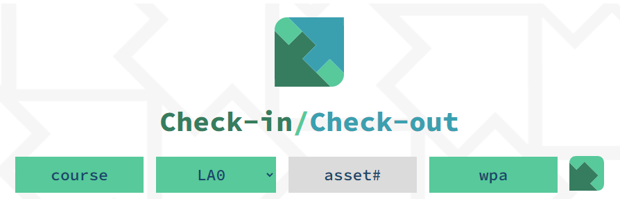
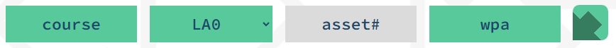
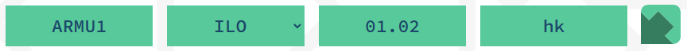
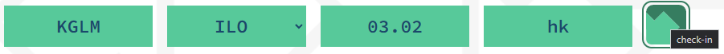
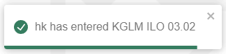
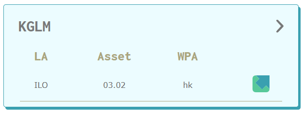
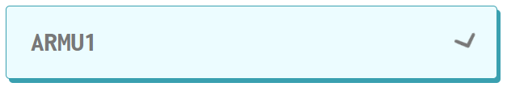
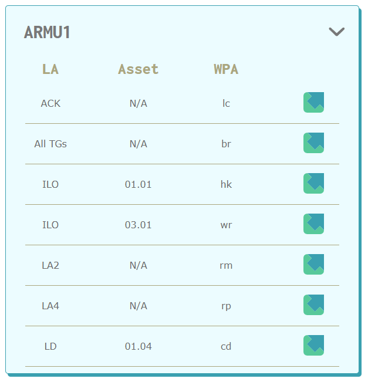
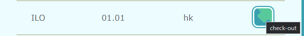
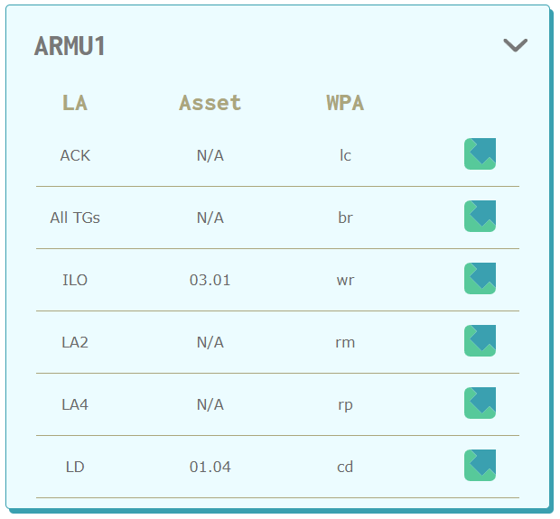

# check-in/check-out

## Description
This is a MERN application that updates in real time across browsers using Socket.io for all users that currently have it open in the browser. This project was made for TVO's Elementary department and is in production use. 

With the check-in/check-out app, Web Production Artists are able to efficiently keep track of which assets are in use and which assets are available. With real time notifications for when a WPA enters and exits a course and error validation, we are able to avoid merge conflicts when working on assets. 

## Table Of Contents
- [Technologies](#Technologies-Used)
- [Usage](#Usage)
- [Checking into an asset](#Checking-into-an-asset)
- [Checking out of an asset](#Checking-out-of-an-asset)
- [View Live Website](#View-Live-Website)
- [Questions](#Questions)
- [License](#License)

## Technologies Used
For this application I used the following technologies: React, JavaScript, Sass, Axios, Socket.io, React-Toastify, Mongoose, MongoDB, MongoAtlas, Node-Express, and Heroku.

## Checking into an asset

   

1. Insert your course name (this must be a valid elementary course that exists or the 101)

2. Select which asset you would like to check into to

<h2>Acronyms:</h2>
    
    - LA: Learning Activity
    - TG: Teacher Guide
    - ILO: Interactive Learning Object
    - LD: Lockerdoc
    - ACK: Acknowledgement
    - AT: Audio Transcript

3. Insert the asset request number if required (ILOs, LDs, ATs and the 101 require the WPA to fill out this field)

    ILOs, LDs and ATs require a 4 digit code:

    

    101 requires the file name:

    

4. Once all require fields have been filled out, click the "check-in" button:

   

5. All users will then receive a notification that a user has checked-in and it will render into the course names accordion

    Notification:

    

    Rendered accordion:

    
 
 
 
## Checking out of an asset

1. Start by clicking on the accordion that matches your course name:

   

2. Navigate to the asset you want to check out of:

   

3. Click the "check-out" button:

   

4. A delete prompt will then check to confirm if you want to check-out:

   

5. The asset will then be removed from the accordion and a delete notification will be sent out to all users:

   Notification:

   

   Rendered Accordion:

   

## View Live Website  
This website is currently in production use and unavailable to the public

## Questions
To view my other repositories or to connect with me on GitHub please click **[Here](https://github.com/HustinKava/)**
If you have any questions please feel free to reach out to me at the following email: *hkavafsd@gmail.com*

## License
